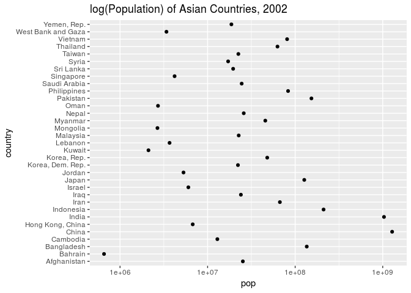
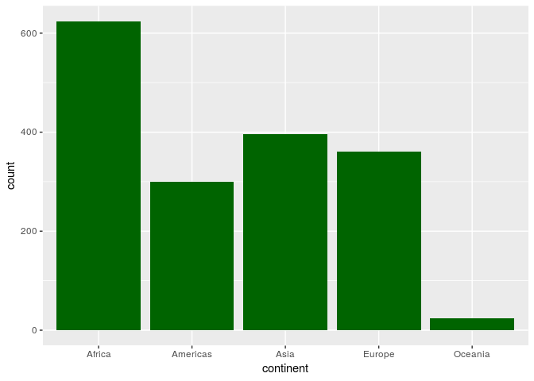
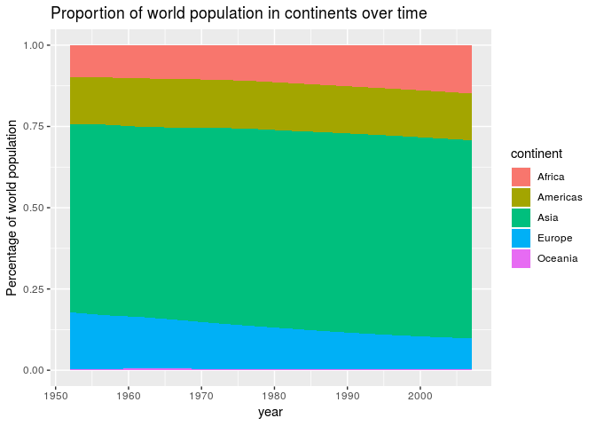

Assignment 5
================

-   [Bringing in Rectangular data](#bringing-in-rectangular-data)
-   [Part 1: Factor Management](#part-1-factor-management)
    -   [Drop Oceania](#drop-oceania)
    -   [Actually dropping Oceania](#actually-dropping-oceania)
    -   [Factor reordering](#factor-reordering)
    -   [arrange](#arrange)
-   [Part 2: File I/O](#part-2-file-io)
    -   [write\_csv()/read\_csv()](#write_csvread_csv)
    -   [saveRDS()/readRDS()](#saverdsreadrds)
-   [Part 3: Visualization Design](#part-3-visualization-design)
    -   [Plotly](#plotly)
-   [Part 4: Writing Figures to File](#part-4-writing-figures-to-file)

Author: Ray Wu

Bringing in Rectangular data
----------------------------

First, we load the `gapminder` and `tidyverse` packages:

``` r
library(gapminder)
library(tidyverse)
```

    ## Note: the specification for S3 class "difftime" in package 'lubridate' seems equivalent to one from package 'hms': not turning on duplicate class definitions for this class.

    ## ── Attaching packages ──────────────────────────────────────────────────────────────────────────────────────────────────── tidyverse 1.2.1 ──

    ## ✔ ggplot2 3.0.0     ✔ purrr   0.2.5
    ## ✔ tibble  1.4.2     ✔ dplyr   0.7.6
    ## ✔ tidyr   0.8.1     ✔ stringr 1.3.1
    ## ✔ readr   1.1.1     ✔ forcats 0.3.0

    ## ── Conflicts ─────────────────────────────────────────────────────────────────────────────────────────────────────── tidyverse_conflicts() ──
    ## ✖ dplyr::filter() masks stats::filter()
    ## ✖ dplyr::lag()    masks stats::lag()

Part 1: Factor Management
-------------------------

### Drop Oceania

First, let's take a look at the dataset:

``` r
knitr::kable(head(gapminder))
```

| country     | continent |  year|  lifeExp|       pop|  gdpPercap|
|:------------|:----------|-----:|--------:|---------:|----------:|
| Afghanistan | Asia      |  1952|   28.801|   8425333|   779.4453|
| Afghanistan | Asia      |  1957|   30.332|   9240934|   820.8530|
| Afghanistan | Asia      |  1962|   31.997|  10267083|   853.1007|
| Afghanistan | Asia      |  1967|   34.020|  11537966|   836.1971|
| Afghanistan | Asia      |  1972|   36.088|  13079460|   739.9811|
| Afghanistan | Asia      |  1977|   38.438|  14880372|   786.1134|

So now, we know that we are dropping the 'Oceania' level from the 'continent' factor

Let's take a look what would happen when we drop Oceania:

``` r
gapminder %>% 
  filter(continent == 'Oceania') %>% 
  knitr::kable()
```

| country     | continent |  year|  lifeExp|       pop|  gdpPercap|
|:------------|:----------|-----:|--------:|---------:|----------:|
| Australia   | Oceania   |  1952|   69.120|   8691212|   10039.60|
| Australia   | Oceania   |  1957|   70.330|   9712569|   10949.65|
| Australia   | Oceania   |  1962|   70.930|  10794968|   12217.23|
| Australia   | Oceania   |  1967|   71.100|  11872264|   14526.12|
| Australia   | Oceania   |  1972|   71.930|  13177000|   16788.63|
| Australia   | Oceania   |  1977|   73.490|  14074100|   18334.20|
| Australia   | Oceania   |  1982|   74.740|  15184200|   19477.01|
| Australia   | Oceania   |  1987|   76.320|  16257249|   21888.89|
| Australia   | Oceania   |  1992|   77.560|  17481977|   23424.77|
| Australia   | Oceania   |  1997|   78.830|  18565243|   26997.94|
| Australia   | Oceania   |  2002|   80.370|  19546792|   30687.75|
| Australia   | Oceania   |  2007|   81.235|  20434176|   34435.37|
| New Zealand | Oceania   |  1952|   69.390|   1994794|   10556.58|
| New Zealand | Oceania   |  1957|   70.260|   2229407|   12247.40|
| New Zealand | Oceania   |  1962|   71.240|   2488550|   13175.68|
| New Zealand | Oceania   |  1967|   71.520|   2728150|   14463.92|
| New Zealand | Oceania   |  1972|   71.890|   2929100|   16046.04|
| New Zealand | Oceania   |  1977|   72.220|   3164900|   16233.72|
| New Zealand | Oceania   |  1982|   73.840|   3210650|   17632.41|
| New Zealand | Oceania   |  1987|   74.320|   3317166|   19007.19|
| New Zealand | Oceania   |  1992|   76.330|   3437674|   18363.32|
| New Zealand | Oceania   |  1997|   77.550|   3676187|   21050.41|
| New Zealand | Oceania   |  2002|   79.110|   3908037|   23189.80|
| New Zealand | Oceania   |  2007|   80.204|   4115771|   25185.01|

Since we have 24 rows and 12 years for each country, we should have 24 entries less or 2 countries less after the modification, whatever one would prefer.

We can also get more information about the dataset as follows:

``` r
gapminder %>% 
  str()
```

    ## Classes 'tbl_df', 'tbl' and 'data.frame':    1704 obs. of  6 variables:
    ##  $ country  : Factor w/ 142 levels "Afghanistan",..: 1 1 1 1 1 1 1 1 1 1 ...
    ##  $ continent: Factor w/ 5 levels "Africa","Americas",..: 3 3 3 3 3 3 3 3 3 3 ...
    ##  $ year     : int  1952 1957 1962 1967 1972 1977 1982 1987 1992 1997 ...
    ##  $ lifeExp  : num  28.8 30.3 32 34 36.1 ...
    ##  $ pop      : int  8425333 9240934 10267083 11537966 13079460 14880372 12881816 13867957 16317921 22227415 ...
    ##  $ gdpPercap: num  779 821 853 836 740 ...

### Actually dropping Oceania

``` r
(gapminder_no_oceania = gapminder %>% 
  filter(continent != 'Oceania'))
```

    ## # A tibble: 1,680 x 6
    ##    country     continent  year lifeExp      pop gdpPercap
    ##    <fct>       <fct>     <int>   <dbl>    <int>     <dbl>
    ##  1 Afghanistan Asia       1952    28.8  8425333      779.
    ##  2 Afghanistan Asia       1957    30.3  9240934      821.
    ##  3 Afghanistan Asia       1962    32.0 10267083      853.
    ##  4 Afghanistan Asia       1967    34.0 11537966      836.
    ##  5 Afghanistan Asia       1972    36.1 13079460      740.
    ##  6 Afghanistan Asia       1977    38.4 14880372      786.
    ##  7 Afghanistan Asia       1982    39.9 12881816      978.
    ##  8 Afghanistan Asia       1987    40.8 13867957      852.
    ##  9 Afghanistan Asia       1992    41.7 16317921      649.
    ## 10 Afghanistan Asia       1997    41.8 22227415      635.
    ## # ... with 1,670 more rows

I'm not going to put the tables with a large number of rows into `knitr::kable()` because then all the rows will be rendered.

Let's check the modified factor:

``` r
gapminder_no_oceania$continent %>% 
  levels()
```

    ## [1] "Africa"   "Americas" "Asia"     "Europe"   "Oceania"

We still have Oceania! We need to call the `droplevels()` function to *actually* drop Oceania.

``` r
(gapminder_no_oceania = gapminder_no_oceania %>% 
  droplevels())
```

    ## # A tibble: 1,680 x 6
    ##    country     continent  year lifeExp      pop gdpPercap
    ##    <fct>       <fct>     <int>   <dbl>    <int>     <dbl>
    ##  1 Afghanistan Asia       1952    28.8  8425333      779.
    ##  2 Afghanistan Asia       1957    30.3  9240934      821.
    ##  3 Afghanistan Asia       1962    32.0 10267083      853.
    ##  4 Afghanistan Asia       1967    34.0 11537966      836.
    ##  5 Afghanistan Asia       1972    36.1 13079460      740.
    ##  6 Afghanistan Asia       1977    38.4 14880372      786.
    ##  7 Afghanistan Asia       1982    39.9 12881816      978.
    ##  8 Afghanistan Asia       1987    40.8 13867957      852.
    ##  9 Afghanistan Asia       1992    41.7 16317921      649.
    ## 10 Afghanistan Asia       1997    41.8 22227415      635.
    ## # ... with 1,670 more rows

``` r
gapminder_no_oceania$continent %>% 
  levels()
```

    ## [1] "Africa"   "Americas" "Asia"     "Europe"

Now, we see that Oceania is actually gone for good.

Creating a smaller version of the dataset to read/write from the disk (dataset filtered down to data from 2002) and to reorder factors

``` r
(gapminder_2002 = gapminder %>% 
  filter(year == 2002))
```

    ## # A tibble: 142 x 6
    ##    country     continent  year lifeExp       pop gdpPercap
    ##    <fct>       <fct>     <int>   <dbl>     <int>     <dbl>
    ##  1 Afghanistan Asia       2002    42.1  25268405      727.
    ##  2 Albania     Europe     2002    75.7   3508512     4604.
    ##  3 Algeria     Africa     2002    71.0  31287142     5288.
    ##  4 Angola      Africa     2002    41.0  10866106     2773.
    ##  5 Argentina   Americas   2002    74.3  38331121     8798.
    ##  6 Australia   Oceania    2002    80.4  19546792    30688.
    ##  7 Austria     Europe     2002    79.0   8148312    32418.
    ##  8 Bahrain     Asia       2002    74.8    656397    23404.
    ##  9 Bangladesh  Asia       2002    62.0 135656790     1136.
    ## 10 Belgium     Europe     2002    78.3  10311970    30486.
    ## # ... with 132 more rows

``` r
(gapminder_asia_2002 = gapminder_2002 %>% 
  filter(continent == 'Asia')) %>% 
  knitr::kable()
```

| country            | continent |  year|  lifeExp|         pop|   gdpPercap|
|:-------------------|:----------|-----:|--------:|-----------:|-----------:|
| Afghanistan        | Asia      |  2002|   42.129|    25268405|    726.7341|
| Bahrain            | Asia      |  2002|   74.795|      656397|  23403.5593|
| Bangladesh         | Asia      |  2002|   62.013|   135656790|   1136.3904|
| Cambodia           | Asia      |  2002|   56.752|    12926707|    896.2260|
| China              | Asia      |  2002|   72.028|  1280400000|   3119.2809|
| Hong Kong, China   | Asia      |  2002|   81.495|     6762476|  30209.0152|
| India              | Asia      |  2002|   62.879|  1034172547|   1746.7695|
| Indonesia          | Asia      |  2002|   68.588|   211060000|   2873.9129|
| Iran               | Asia      |  2002|   69.451|    66907826|   9240.7620|
| Iraq               | Asia      |  2002|   57.046|    24001816|   4390.7173|
| Israel             | Asia      |  2002|   79.696|     6029529|  21905.5951|
| Japan              | Asia      |  2002|   82.000|   127065841|  28604.5919|
| Jordan             | Asia      |  2002|   71.263|     5307470|   3844.9172|
| Korea, Dem. Rep.   | Asia      |  2002|   66.662|    22215365|   1646.7582|
| Korea, Rep.        | Asia      |  2002|   77.045|    47969150|  19233.9882|
| Kuwait             | Asia      |  2002|   76.904|     2111561|  35110.1057|
| Lebanon            | Asia      |  2002|   71.028|     3677780|   9313.9388|
| Malaysia           | Asia      |  2002|   73.044|    22662365|  10206.9779|
| Mongolia           | Asia      |  2002|   65.033|     2674234|   2140.7393|
| Myanmar            | Asia      |  2002|   59.908|    45598081|    611.0000|
| Nepal              | Asia      |  2002|   61.340|    25873917|   1057.2063|
| Oman               | Asia      |  2002|   74.193|     2713462|  19774.8369|
| Pakistan           | Asia      |  2002|   63.610|   153403524|   2092.7124|
| Philippines        | Asia      |  2002|   70.303|    82995088|   2650.9211|
| Saudi Arabia       | Asia      |  2002|   71.626|    24501530|  19014.5412|
| Singapore          | Asia      |  2002|   78.770|     4197776|  36023.1054|
| Sri Lanka          | Asia      |  2002|   70.815|    19576783|   3015.3788|
| Syria              | Asia      |  2002|   73.053|    17155814|   4090.9253|
| Taiwan             | Asia      |  2002|   76.990|    22454239|  23235.4233|
| Thailand           | Asia      |  2002|   68.564|    62806748|   5913.1875|
| Vietnam            | Asia      |  2002|   73.017|    80908147|   1764.4567|
| West Bank and Gaza | Asia      |  2002|   72.370|     3389578|   4515.4876|
| Yemen, Rep.        | Asia      |  2002|   60.308|    18701257|   2234.8208|

### Factor reordering

Now we will see what happens before we reorder the factors:

``` r
gapminder_asia_2002 %>% 
  ggplot(aes(pop, country)) + 
  geom_point() + 
  scale_x_log10() + 
  xlab('log(pop)') + 
  ggtitle('log(Population) of Asian Countries, 2002')
```


It's pretty diffcult to get any sense of ordering on this graph.

Now we will reorder the levels and re-make this plot:

``` r
gapminder_asia_2002 %>% 
  mutate(country = fct_reorder(country, pop, .fun=median)) %>% 
  ggplot(aes(pop, country)) + 
  geom_point() + 
  scale_x_log10() + 
  xlab('log(pop)') + 
  ggtitle('log(Population) of Asian Countries, 2002')
```


This is clearly a much better graph as it also allows us to - view the extreme points much easily - view the distribution much easily

### arrange

It seems that we should be able to do the same thing with `arrange()`. After all, we are only sorting the data before plotting.

``` r
gapminder_asia_2002 %>% 
  arrange(pop)  %>% 
  ggplot(aes(pop, country)) + 
  geom_point() + 
  scale_x_log10() + 
  ggtitle('log(Population) of Asian Countries, 2002')
```



This does not work because we are not changing the factors, which the plot is based off of. We are changing the rows in the table, but the categories are still plotted alphabetically.

Using `fct_reorder`, on the other hand, actually relabels the categories according to the ranking of their population. Hence, the plot with `fct_reorder` is different because the first category corresponds to the country with highest population, instead of the first country that comes along alphabetically.

Part 2: File I/O
----------------

We will demonstrate file i/o with the `gapminder_2002` data frame.

### write\_csv()/read\_csv()

``` r
write_csv(gapminder_2002, 'gapminder_2002.csv')
```

confirm that the file exists:

``` r
list.files(pattern = "gapminder_2002.csv")
```

    ## [1] "gapminder_2002.csv"

We see that the file `gapminder_2002.csv` exists so we know that `write_csv` worked as intended

``` r
read_data = read_csv('gapminder_2002.csv')
```

    ## Parsed with column specification:
    ## cols(
    ##   country = col_character(),
    ##   continent = col_character(),
    ##   year = col_integer(),
    ##   lifeExp = col_double(),
    ##   pop = col_integer(),
    ##   gdpPercap = col_double()
    ## )

``` r
read_data %>% str()
```

    ## Classes 'tbl_df', 'tbl' and 'data.frame':    142 obs. of  6 variables:
    ##  $ country  : chr  "Afghanistan" "Albania" "Algeria" "Angola" ...
    ##  $ continent: chr  "Asia" "Europe" "Africa" "Africa" ...
    ##  $ year     : int  2002 2002 2002 2002 2002 2002 2002 2002 2002 2002 ...
    ##  $ lifeExp  : num  42.1 75.7 71 41 74.3 ...
    ##  $ pop      : int  25268405 3508512 31287142 10866106 38331121 19546792 8148312 656397 135656790 10311970 ...
    ##  $ gdpPercap: num  727 4604 5288 2773 8798 ...
    ##  - attr(*, "spec")=List of 2
    ##   ..$ cols   :List of 6
    ##   .. ..$ country  : list()
    ##   .. .. ..- attr(*, "class")= chr  "collector_character" "collector"
    ##   .. ..$ continent: list()
    ##   .. .. ..- attr(*, "class")= chr  "collector_character" "collector"
    ##   .. ..$ year     : list()
    ##   .. .. ..- attr(*, "class")= chr  "collector_integer" "collector"
    ##   .. ..$ lifeExp  : list()
    ##   .. .. ..- attr(*, "class")= chr  "collector_double" "collector"
    ##   .. ..$ pop      : list()
    ##   .. .. ..- attr(*, "class")= chr  "collector_integer" "collector"
    ##   .. ..$ gdpPercap: list()
    ##   .. .. ..- attr(*, "class")= chr  "collector_double" "collector"
    ##   ..$ default: list()
    ##   .. ..- attr(*, "class")= chr  "collector_guess" "collector"
    ##   ..- attr(*, "class")= chr "col_spec"

We don't see a factor anywhere. This indicates that the factors are not preserved after writing to a CSV file. We will see a better method to do this in the next section.

### saveRDS()/readRDS()

``` r
gapminder_2002 %>% saveRDS('gapminder_2002.rds')
```

Check to make sure that the file exists:

``` r
list.files(pattern = "gapminder_2002.rds")
```

    ## [1] "gapminder_2002.rds"

As expected, the file exists.

Now, read in the file again:

``` r
rds_file = readRDS('gapminder_2002.rds')
```

No errors! That's a good start, now let's check the dataset description:

``` r
rds_file %>% str()
```

    ## Classes 'tbl_df', 'tbl' and 'data.frame':    142 obs. of  6 variables:
    ##  $ country  : Factor w/ 142 levels "Afghanistan",..: 1 2 3 4 5 6 7 8 9 10 ...
    ##  $ continent: Factor w/ 5 levels "Africa","Americas",..: 3 4 1 1 2 5 4 3 3 4 ...
    ##  $ year     : int  2002 2002 2002 2002 2002 2002 2002 2002 2002 2002 ...
    ##  $ lifeExp  : num  42.1 75.7 71 41 74.3 ...
    ##  $ pop      : int  25268405 3508512 31287142 10866106 38331121 19546792 8148312 656397 135656790 10311970 ...
    ##  $ gdpPercap: num  727 4604 5288 2773 8798 ...

As expected, we do not encounter any problems with reading in the `.rds` file. In particular, we note that country and continent are factors as expected.

(Note that I filtered from the *original* data frame, so we still have 142 countries and 5 continents)

Part 3: Visualization Design
----------------------------

I am going to re-make a plot I handed in for assignment 2:

**original:**

``` r
ggplot(gapminder, aes(continent)) + 
  geom_bar(fill = 'dark green')
```



Let's see how we can improve this:

-   count on the y-axis is unclear. It seems that we are recording the number of countries, but it is not apparent from the axis
-   we should give a title
-   entries from different years are all mixed together. It is hard to imagine this being useful.
-   could be more colourful although the current scheme is readable

Instead, I am going to do the following:

-   contrast the total population of the 5 continents
-   express these values as percentages in order to make it easy to see which continents have increased and decreased their proportion of world population
-   give the graph a meaningful title
-   use colour to contrast the change or some other meaningful way
-   separate the years

First, let's calculate the sum of population for each continent/each year

``` r
plot_data = gapminder %>% 
  group_by(continent,year) %>% 
  summarize(totalPop = sum((as.double(pop)))) # we need this to prevent integer overflow 
```

We also need to get the world population for each point in time, which the following code block does:

``` r
plot_data = plot_data %>%
  group_by(year) %>% 
  mutate(popRatio = totalPop/sum(totalPop))
```

Finally, we generate a stacked-area graph, which allows us to accurately visualize the proportion of categories over time; in this case, it is the continents and how their population progresses as a proportion of the world population.

``` r
(improved_graph = plot_data %>%
  ggplot(aes(year, popRatio, fill=continent)) + 
  geom_area(position = 'stack') + 
  xlab('year') +
  ylab('Percentage of world population') +
  ggtitle('Proportion of world population in continents over time'))
```



We can see from this graph that Asia has the majority of the world's population, and Americas' hasn't changed must in the last 60 years or so. Africa's population has increased and Europe's has decreased. Oceania has always been rather un-populated.

### Plotly

Load the library `plotly`:

``` r
library(plotly)
```

    ## 
    ## Attaching package: 'plotly'

    ## The following object is masked from 'package:ggplot2':
    ## 
    ##     last_plot

    ## The following object is masked from 'package:stats':
    ## 
    ##     filter

    ## The following object is masked from 'package:graphics':
    ## 
    ##     layout

Convert the `ggplot` object into a `plotly` object:

``` r
improved_graph_plotly = improved_graph %>% ggplotly()
```

Let's take a look at the new file:

``` r
# improved_graph_plotly
# commented out because github doesn't support it.  
```

I commented out the code that displays the `plotly` plot. This is because github does not render it properly (it's a mess of `javascript` and `html` I think). But I did execute the code on my local machine and you can un-comment the code if you want to see it.

The most distinctive thing about the `plotly` graph is *interactivity*: I can hover my mouse over a data point and I can read it off. This seems to be better for people using `Rmd` but not necessarily for publishing graphs in papers because obviously such a feature is not possible on paper or `pdf`.

Also, this is not checkable on github because it is rendered in `md`.

Part 4: Writing Figures to File
-------------------------------

Saving the figure to a file:

``` r
ggsave('pop_prop_time.png', plot = improved_graph)
```

    ## Saving 7 x 5 in image

``` r
ggsave('pop_prop_time.pdf')
```

    ## Saving 7 x 5 in image

we do not have to include the `plot = improved_graph`, because `improved_graph` is the last plot we generated.

If we want to go back and save an earlier plot, then this is actually necessary.


[The same graph, in PDF format](https://github.com/STAT545-UBC-students/hw05-rning-wu/blob/master/gapminder_files/pop_prop_time.pdf)

We see that the `pdf` is *vector* graphics, rather than *raster* graphics that `png` files use. Vector graphics have an advantage in that they are able to be rescaled without loss of image quality.
